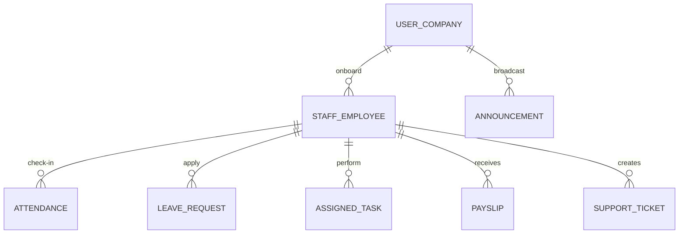

# 💼 PaySlip Pro — Knowledge Transfer (KT) Manual
**Version:** 3.0 (Enterprise HRMS Edition)  
**Target Audience:** Software Engineers, System Administrators, and DevOps Engineers.

---

## 1. Executive Summary & Project Context

**PaySlip Pro** is a lightweight, scalable, and fully functional **Human Resource Management System (HRMS)** and **Employee Self-Service (ESS)** portal custom-built for small-to-medium businesses (SMBs). 

It automates and simplifies:
* **Administrative Operations:** Staff onboarding, leave policy definition, task assignment, corporate announcements, support desk ticketing, and audit logs.
* **Employee Self-Service (ESS):** Real-time daily attendance punch cards, task status reporting, leave applications, secure document uploads (KYC), and payslip history download.
* **Compliant Indian Payroll Calculations:** Computes Basic, HRA, PF, ESI, Professional Tax (PT), Overtime, and pro-rated salary based on actual attendance/paid days.

---

## 2. Technical Stack

| Layer | Technologies & Libraries | Key Responsibility |
|---|---|---|
| **Frontend** | React (v18), Vite, React Router (v6), Axios, Lucide React, React Hot Toast | Responsive, fast Single Page Application (SPA). Proxies API calls via Vite config. |
| **Backend** | Node.js, Express, Nodemailer, PDFKit, Cloudinary (optional) | Core business logic, SMTP notification engine, dynamic PDF generation, and secure file streaming. |
| **Database** | MongoDB Atlas, Mongoose | Schema definitions, relations, transaction/audit records, and safe connection caching. |
| **Hosting** | Vercel (Serverless Stack) or Render.com | Deployable as a single unified service (Express serving built frontend) or serverless APIs. |

---

## 3. Directory Structure & Key Code Entry Points

```
payslip-generator/
├── backend/
│   ├── models/                # Mongoose Database Schemas
│   │   ├── Attendance.js      # Daily punch times, total hours, and session arrays
│   │   ├── Payslip.js         # Persisted financial totals and calculated taxes
│   │   ├── Staff.js           # Employees/interns, financials, KYC docs, credentials
│   │   ├── User.js            # Admin profiles (Companies), SMTP settings, work days
│   │   └── ... (announcements, leaves, support tickets, tasks)
│   ├── routes/                # Express API Handlers
│   │   ├── auth.js            # Admin sign-up, verification, login, passwords
│   │   ├── staffPortal.js     # Employee login, password setup, ESS profile, and KYC
│   │   ├── attendance.js      # Punch card logic, status checking, and manual overrides
│   │   ├── payslip.js         # Financial computations, PDF stream, SMTP email distribution
│   │   └── ... (tasks, announcements, audit logs, leave policies)
│   ├── utils/                 # Auxiliary Services
│   │   ├── attendanceService.js  # Helper functions for timezone adjustment & calculations
│   │   ├── emailService.js    # Transporter configurations and HTML email templates
│   │   ├── pdfGenerator.js    # PDFKit configuration, styling, and design layout (A4)
│   │   ├── cloudinary.js      # Cloudinary API wrappers for KYC and logo file uploads
│   │   └── cronJobs.js        # Scheduled punch-out checks and reminder triggers
│   ├── server.js              # Server entry point, middleware setup, connection caching
│   └── package.json           # Node configuration and script definitions
│
└── frontend/
    ├── src/
    │   ├── context/           # React Global State
    │   │   ├── AuthContext.jsx         # Admin login and profile state
    │   │   ├── StaffPortalContext.jsx  # Employee portal state (token, check-in details)
    │   │   └── ThemeContext.jsx        # App-wide light/dark themes
    │   ├── pages/             # UI Views
    │   │   ├── portal/        # Employee Portal Views (Dashboard, Attendance, KYC, Tasks)
    │   │   ├── Dashboard.jsx  # Admin Stats panel and summary charts
    │   │   ├── GeneratePayslip.jsx     # Wizard-driven 3-step payroll tool
    │   │   └── ... (Announcements, Leaves, Audit Logs, Staff List)
    │   ├── components/        # Reusable UI Parts (Sidebar, Layouts, UI buttons/cards)
    │   ├── App.jsx            # Routing configurations and auth guards
    │   └── index.css          # CSS styles and custom UI animations
    └── vite.config.js         # Proxy definitions for API routing (/api -> port 5000)
```

---

## 4. Database Schema Relationships

The database models are designed around a multi-tenant corporate framework:
1. **User (Admin / Company):** The root tenant. Holds company settings, legal metadata, default weekly working days, and company branding logos.
2. **Staff (Employee):** Linked to the parent `User` via `user` ObjectId. Stores personal details, salary configuration, bank accounts, and portal login states.
3. **Attendance, Leaves, Tasks, Payslips, Tickets:** Refer to `Staff` (employee object) and `User` (company tenant). 

### Schema Visual Blueprint (Mermaid Diagram)


---

## 5. Core System Logics & Math Formulations

### 5.1 Payroll Statutory Formulas (Indian Taxation Standards)
When an admin generates a payslip from an employee's annual CTC, the backend uses these automated calculations (`backend/routes/payslip.js`):

* **Monthly Gross Salary** = `CTC / 12`
* **Basic Salary** = `Gross Salary * 0.50` (50% of Gross)
* **House Rent Allowance (HRA)** = `Basic Salary * 0.40` (40% of Basic)
* **Special Allowance** = `Gross Salary - (Basic Salary + HRA)` (Plugs the gap to match Gross)
* **Employer PF Contribution** = `Basic Salary * 0.12` (subtracted from CTC calculation to get true Gross, if applicable)
* **Employee PF Deduction** = `Basic Salary * 0.12` (deducted from Gross)
* **Employee ESI Deduction** = `Gross Salary * 0.0075` (0.75% of Gross, only if monthly Gross is $\le$ ₹21,000)
* **Professional Tax (PT)** = ₹200 / month (fixed, only if monthly Gross is $\ge$ ₹15,000)
* **Pro-ration formula (Loss of Pay):**
  $$\text{Pro-rated Component} = \text{Gross Component} \times \left(\frac{\text{Paid Days}}{\text{Working Days}}\right)$$
  *(Interns bypass complex breakdowns; their stipend is pro-rated directly based on stipend amount).*

### 5.2 PDF Generation Layout
* **Library:** `PDFKit` (`backend/utils/pdfGenerator.js`).
* **Format:** A4 portrait layout with custom corporate colors (primary dark-navy and charcoal accents).
* **Logo Integration:** Resolves base64 image URIs from the Company Admin's `companyLogo` schema field and parses/draws them using stream readers.

### 5.3 SMTP Emailing
* **Library:** `Nodemailer` (`backend/utils/emailService.js`).
* **Authentication:** Uses the company's designated Gmail `EMAIL_USER` and secure 16-character **App Password** (`EMAIL_PASS`).
* **Output:** Delivers a modern HTML branded template with an embedded attachment containing the compiled PDF bytes buffer (`pdfBuffer.js`).

---

## 6. Critical Engineering Edge Cases & Solutions

### 6.1 MongoDB Atlas M0 Email Index Hang Workaround
* **Background:** In MongoDB Atlas's free M0 tier, executing search queries using index structures on email strings can occasionally hang under certain network configurations, resulting in client query timeouts.
* **The Hack:** Implemented an in-memory matching bypass in the authentication and lookup middleware (`backend/routes/auth.js` & `backend/routes/staffPortal.js`).
* **Implementation:** Instead of querying directly via `{ email }`, the server fetches all staffs, reads them into memory using `find({}).toArray()`, and filters them using JavaScript arrays:
  ```javascript
  const allStaffs = await mongoose.connection.db.collection('staffs').find({}).toArray();
  const staff = allStaffs.find(s => s.email.toLowerCase() === inputEmail.toLowerCase());
  ```
  This guarantees instant resolution without database-level search locks on free tiers.

### 6.2 Attendance Auto-Punch Out Safeguards
* **Problem:** Staff members frequently forget to clock out, causing timecards to remain active indefinitely.
* **Double Protection Logic:**
  1. **Automated Daily Cron (`backend/utils/cronJobs.js`):** Runs daily at **7:30 PM IST** (14:00 UTC). It automatically finds open sessions from the current day and past days, closes them, writes an auto-checkout flag, logs a warning note, and triggers an in-app and email alert.
  2. **In-Memory Login Sweep:** When an employee clocks in or logs in, the backend checks if there is any active session from previous calendar days. If found, it retroactively closes it at exactly `23:59:59` of that day to prevent log distortion.

### 6.3 PDFKit Font Resiliency
* Serverless engines (like Vercel) often lack physical font libraries. The PDF generator implements a fallback mechanism: it attempts to load local `Inter-Regular.ttf` assets, failing which it silently degrades to the system-standard `Helvetica` to prevent runtime system failures during generation.

---

## 7. System Maintenance & Diagnostic Scripts

The project contains several utility scripts at `/backend/` and `/scripts/` designed to debug issues, clean data corruptions, and reset credentials.

* **Database Operations & Checks:**
  * [check_live_db.js](file:///c:/Users/Rohit CR/Downloads/payslip-generator-main/payslip-generator-main/backend/check_live_db.js): Quick script to test connections and read standard database status metrics.
  * [scan_corruption.js](file:///c:/Users/Rohit CR/Downloads/payslip-generator-main/payslip-generator-main/backend/scan_corruption.js): Inspects database collections for schema inconsistencies or invalid references.
  * [list_dbs.js](file:///c:/Users/Rohit CR/Downloads/payslip-generator-main/payslip-generator-main/backend/list_dbs.js): Lists all databases under the connected MongoDB cluster.
  * [list_indexes.js](file:///c:/Users/Rohit CR/Downloads/payslip-generator-main/payslip-generator-main/backend/list_indexes.js) & [drop_index.js](file:///c:/Users/Rohit CR/Downloads/payslip-generator-main/payslip-generator-main/backend/drop_index.js): Used to monitor and drop indexes that cause timeouts on MongoDB M0.
  
* **Staff & Payroll Diagnostics:**
  * [check_lost_staff_company.js](file:///c:/Users/Rohit%20CR/Downloads/payslip-generator-main/payslip-generator-main/backend/check_lost_staff_company.js): Detects staff records lacking a valid parent `User` reference.
  * [find_orphans.js](file:///c:/Users/Rohit%20CR/Downloads/payslip-generator-main/payslip-generator-main/backend/find_orphans.js) & [restore_lost_staff.js](file:///c:/Users/Rohit%20CR/Downloads/payslip-generator-main/payslip-generator-main/backend/restore_lost_staff.js): Fixes and re-maps disconnected staff members back to corporate admin records.
  * [fix_staff_data.js](file:///c:/Users/Rohit%20CR/Downloads/payslip-generator-main/payslip-generator-main/backend/fix_staff_data.js) & [fix_staffs_collection.js](file:///c:/Users/Rohit%20CR/Downloads/payslip-generator-main/payslip-generator-main/backend/fix_staffs_collection.js): Batch updates staff properties and repairs broken fields.
  
* **Authentication Tools:**
  * [reset_rohit_pass.js](file:///c:/Users/Rohit CR/Downloads/payslip-generator-main/payslip-generator-main/backend/reset_rohit_pass.js) & [reset_pass.js](file:///c:/Users/Rohit%20CR/Downloads/payslip-generator-main/payslip-generator-main/backend/reset_pass.js): Direct backend scripts to reset passwords for specific admin or staff emails without invoking the SMTP pipeline.
  
* **PDF & Email Smoke Tests:**
  * [test-email.js](file:///c:/Users/Rohit%20CR/Downloads/payslip-generator-main/payslip-generator-main/backend/test-email.js) & [smoke-smtp.js](file:///c:/Users/Rohit%20CR/Downloads/payslip-generator-main/payslip-generator-main/backend/smoke-smtp.js): Rapid SMTP link triggers to confirm Gmail credentials are authenticated and active.
  * [test_pdf_render.js](file:///c:/Users/Rohit%20CR/Downloads/payslip-generator-main/payslip-generator-main/backend/test_pdf_render.js): Test-runs the `pdfGenerator` utility and exports output files (`test_payslip.pdf`) locally for design checking.

---

## 8. Deployment & Execution Runbook

### 8.1 Setup and Local Run
1. **Dependencies:**
   * Backend: Run `npm install` in `/backend`.
   * Frontend: Run `npm install` in `/frontend`.
2. **Environment File Configuration (`/backend/.env`):**
   * Provide `MONGODB_URI`, `EMAIL_USER`, `EMAIL_PASS`, and your `JWT_SECRET`.
   * For local setups, `SKIP_EMAIL_VERIFICATION=true` bypasses registration checks for speed.
3. **Execution Commands:**
   * Backend: Run `npm run dev` (starts on port 5000 / 5001).
   * Frontend: Run `npm run dev` (Vite starts on port 3000, proxies `/api` calls automatically).

### 8.2 Production Deployment Instructions (Render.com)
1. **Configure build command:**
   `npm install && cd ../frontend && npm install && npm run build`
2. **Configure start command:**
   `node server.js` (starts from backend context).
3. **Environment variables checklist:** Ensure `MONGODB_URI`, `EMAIL_USER`, `EMAIL_PASS`, `FRONTEND_URL`, and `PRODUCTION_DOMAIN` are set correctly inside the dashboard context.
